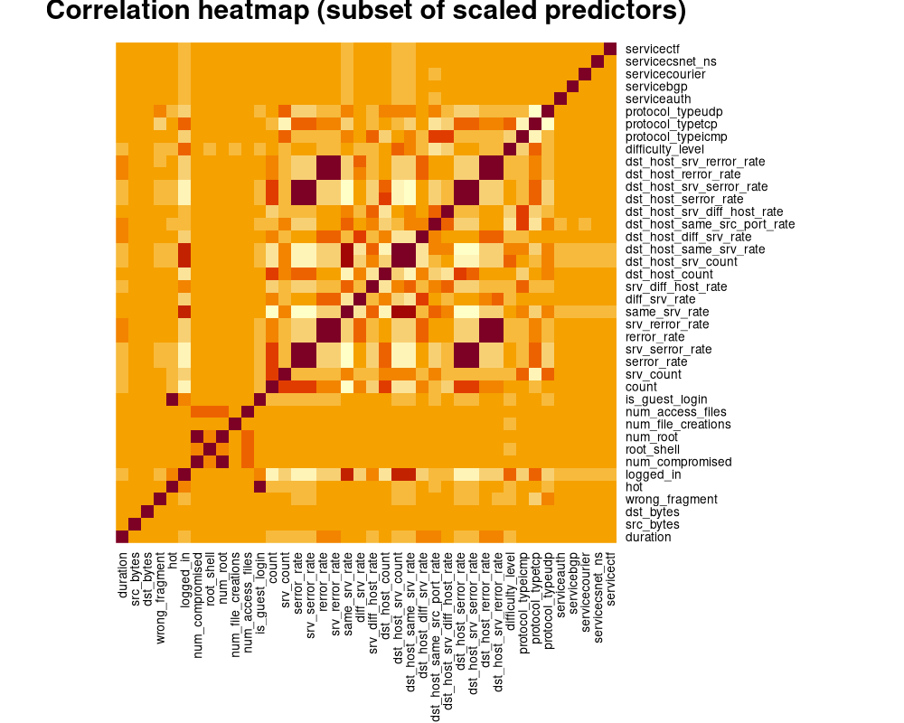
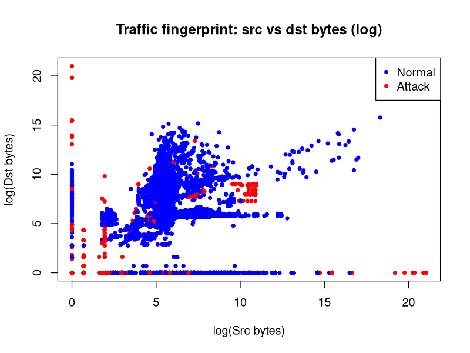
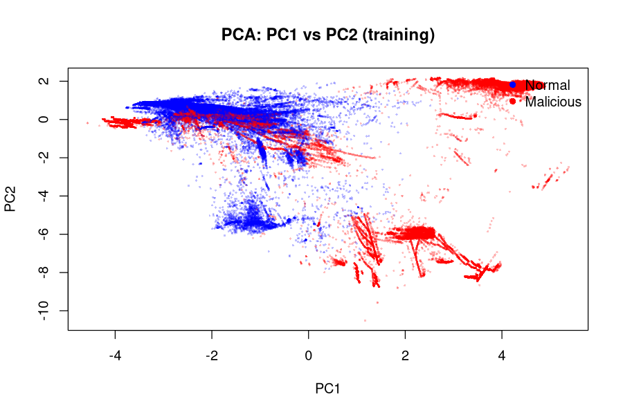
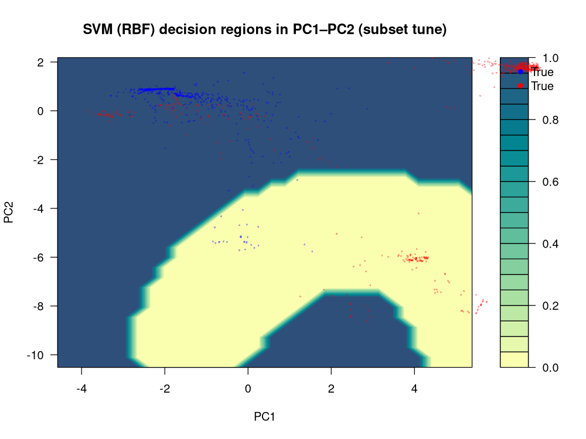
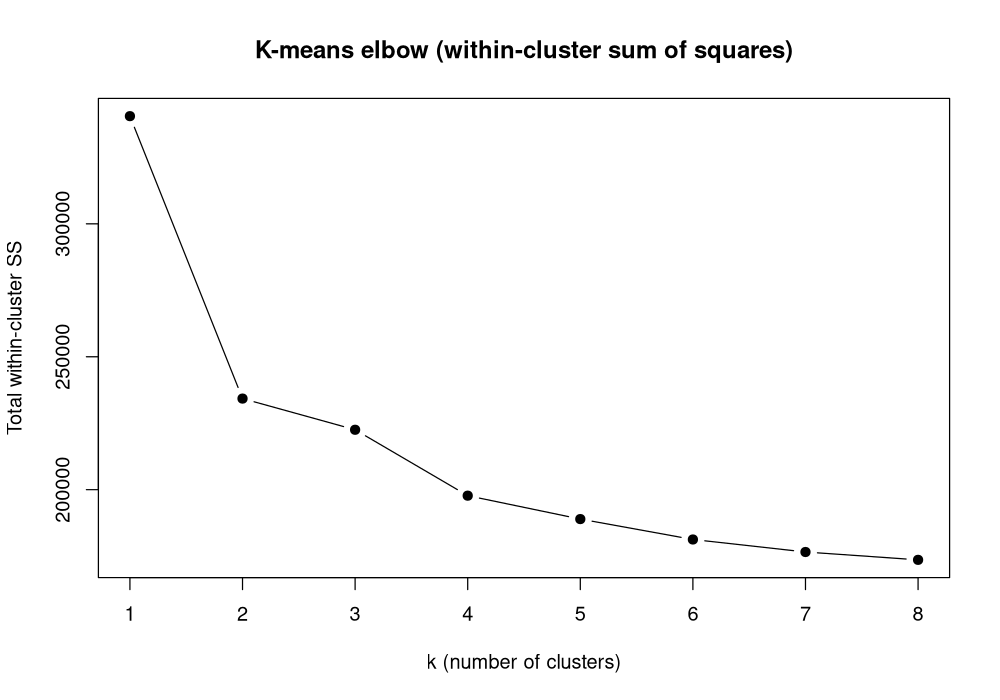
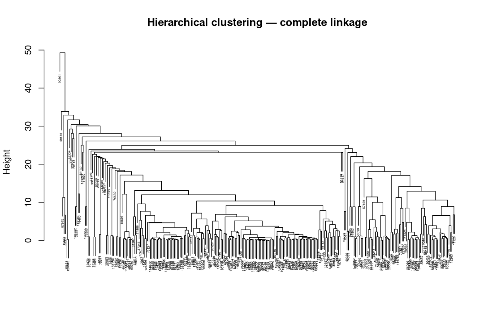

## 1. Introduction

Network intrusion detection is a natural fit for the methods in this course: each NSL-KDD connection combines symbolic fields (protocol, service, TCP flag) with numeric traffic and host statistics, and the task is to separate benign `normal` sessions from attacks summarized under a single malicious label for binary classification. I compare **K-nearest neighbors (KNN)** and **soft-margin SVM with an RBF kernel** under a shared train–test protocol, and I use **PCA**, **K-means**, and **hierarchical clustering** to describe structure in the scaled feature space and to sanity-check clusters against the label without treating the label as part of the unsupervised fit.

The training file `KDDTrain.csv` has 125,973 rows and 43 raw columns; `KDDTest.csv` has 22,544 rows. The binary response sets `target = 0` when `attack_type` is normal and `target = 1` otherwise. In training there are 67,343 normal and 58,630 attack connections, so classes are imbalanced but neither is negligible—accuracy, sensitivity, and specificity remain meaningful without aggressive reweighting.

Implementation priorities followed the “pipeline first, scale up later” theme documented in the project notes: paths are resolved from the launched script so the pipeline runs from any working directory; preprocessing uses train-only statistics to avoid leakage; tuning uses intentionally small stratified subsamples and **3-fold** cross-validation so an end-to-end run finishes on a laptop, at the cost of noisier tuning than a full 10-fold grid on all rows. Those choices explain occasional quirks (for example **KNN choosing $K=1$** under quick defaults) and are referenced again where they affect interpretation.

## 2. Methodology

The **advantages** of KNN are simplicity and flexible decision boundaries in feature space; disadvantages include cost at prediction time and sensitivity to irrelevant noisy dimensions unless preprocessing is careful. **SVM** with an RBF kernel can capture nonlinear structure with a principled margin objective but requires tuning $(C,\gamma)$ and does not scale trivially to huge $n$. **K-means** is fast and interpretable for partitioning but assumes roughly spherical clusters of comparable size and needs $k$ specified. **Hierarchical clustering** needs no advance $k$ for building the tree but interpretation requires choosing a cut and linkage; complete linkage discourages chaining, single linkage can chain elongated groups, and average linkage sits between them.

**Preprocessing.** The three standard symbolic columns `protocol_type`, `service`, and `flag` are expanded with `model.matrix` instead of **caret** so the project stays on minimal CRAN dependencies (`class`, `e1071`, `cluster`) while still producing a consistent full-rank dummy set. Test factors are forced to the training levels with unseen service levels mapped to the training mode before `model.matrix`, because **KDDTest+** can introduce services absent from training and would otherwise break column alignment. Near-zero-variance columns are removed with a base-R analogue of **caret**’s rule so scaling and distance-based learners are not dominated by almost-constant dummies. Continuous columns are centered and scaled using **training** means and standard deviations only; the test matrix uses those same centers and scales. **PCA** uses `prcomp` on training predictors only—target and `attack_category` are excluded so the rotation is not supervised—and `scale.=FALSE` because features are already z-scored; test scores come from `predict(prcomp_object, X_test)` so loadings are fixed by training data.

**KNN** predicts by majority vote among the $K$ nearest training points in Euclidean distance; $K$ is searched on $\{1,\ldots,21\}$ with stratified subsampling for cross-validation. **SVM** uses the RBF kernel $K(x_i,x_j)=\exp(-\gamma\lVert x_i-x_j\rVert^2)$; $C$ and $\gamma$ are grid-searched with `tune.svm` passing **`cost=` and `gamma=`** vectors (not `ranges=list(...)`, which triggers a duplicate-argument error in **e1071**). Holdout rows for PC-based models use **`Z_all_train[tr_idx]`** and **`Z_all_train[te_idx]`**, not rows from the separate test file, so row indices match the 80/20 split on the training matrix—this was an explicit fix after a misalignment bug. Scoring uses capped stratified reference sets for KNN and SVM when full $n$ is too heavy; champion selection uses holdout accuracy, then refits on more data for the final test CSV.

**Unsupervised analysis** runs K-means and hierarchical clustering on **random subsets** of scaled training features (elbow and K-means on up to 2,500 rows; hierarchical clustering on fewer rows because the distance matrix is $O(n^2)$). Silhouette widths for K-means and for cuts of hierarchical trees use the same distance structure as the clustering step on those subsets.

**Model formulas (course notation).** For KNN, Euclidean distance identifies the $K$ smallest neighbors; the predicted class is their majority vote $\hat{y}(x_0)=\mathrm{mode}\{y_{(1)},\ldots,y_{(K)}\}$. For soft-margin SVM with labels $\{\pm 1\}$, we minimize $\frac{1}{2}\|w\|^2 + C\sum_i \xi_i$ subject to $y_i(w^\top \phi(x_i)+b)\geq 1-\xi_i$, $\xi_i\geq 0$; the **RBF kernel** is $K(x_i,x_j)=\exp(-\gamma\lVert x_i-x_j\rVert^2)$, which induces nonlinear boundaries in the original predictors. **K-means** minimizes within-cluster sum of squares $\sum_{k=1}^K \sum_{x_i\in C_k} \lVert x_i-\mu_k\rVert^2$. **Agglomerative** hierarchical clustering merges clusters using pairwise distances between groups: **complete** linkage uses the maximum between-cluster distance, **average** linkage uses the mean pairwise distance between clusters, and **single** linkage uses the minimum between-cluster distance.

## 3. Data analysis

### 3.1 Redundancy and correlation among predictors

After dummy expansion the predictor matrix is wide; inspecting every pairwise correlation is neither readable nor necessary for the report. The pipeline therefore plots a **heatmap of correlations for the first 40 scaled columns**, which is enough to expose the main story: tight blocks of very strong positive correlation among related rate and error statistics, so many features duplicate information, while sparse service dummies sit largely orthogonal to continuous traffic summaries. That redundancy motivated dropping near-constant columns and later summarizing directions with PCA rather than hoping KNN or SVM would quietly ignore collinearity in high dimension.

### 3.2 Traffic shape and attack outliers

Bar charts of protocol and service (not reproduced here to save space) show heterogeneity that any single rule would miss: TCP dominates volume, ICMP is rare overall but attack-heavy, HTTP is mostly normal while several “private” and low-level services skew attack-heavy. Log-scaled duration separates short control traffic from long-lived TCP sessions. The figure below compresses those ideas into one geometric view: **log source bytes versus log destination bytes**. Normal traffic fills a dense central cloud with mild asymmetry; many attacks appear as **extreme outliers**—including bands of high destination bytes at low source bytes—exactly the kind of structure that distance-based methods can use once scaling stops byte counts from overpowering rate-based features.

### 3.3 Principal components

Scree and cumulative-variance plots are standard companions to PCA; in this run **62** components reach **90%** cumulative variance and **68** reach **95%**, so supervised models that use the approximately **95% variance** rule operate in **`PC1`–`PC68`**. Rather than duplicate those line plots in the PDF, the main visual is the **PC1 versus PC2** scatter colored by `target`. Normal connections form a thick cloud; malicious points spread into wings and satellite structure. Substantial overlap in the plane confirms that **two principal components are only a projection**—perfect linear separation is not visible here, which motivates nonlinear margins (RBF-SVM) and adaptive neighborhoods (KNN) in the full or PC-expanded space.

### 3.4 Supervised results

The training matrix was split **80/20** with `set.seed(4323)`. Models used the stratified tuning caps described above, then were evaluated on the 20% holdout and on **KDDTest+** under two input regimes: **scaled raw dummies** and **principal components** through **PC68**.

| Feature space | Model | Evaluation set | Accuracy | Sensitivity | Specificity | Test error |
|---|---|---:|---:|---:|---:|---:|
| raw_scaled | KNN | train_holdout_20pct | 0.9937 | 0.9932 | 0.9942 | 0.0063 |
| raw_scaled | KNN | KDDTest+ | 0.8077 | 0.6948 | 0.9568 | 0.1923 |
| raw_scaled | SVM_RBF | train_holdout_20pct | 0.9927 | 0.9974 | 0.9886 | 0.0073 |
| raw_scaled | SVM_RBF | KDDTest+ | 0.8184 | 0.7434 | 0.9175 | 0.1816 |
| PC1_PC68 | KNN | train_holdout_20pct | 0.9917 | 0.9874 | 0.9954 | 0.0083 |
| PC1_PC68 | KNN | KDDTest+ | 0.8297 | 0.7338 | 0.9563 | 0.1703 |
| PC1_PC68 | SVM_RBF | train_holdout_20pct | 0.9892 | 0.9919 | 0.9869 | 0.0108 |
| PC1_PC68 | SVM_RBF | KDDTest+ | 0.8223 | 0.7506 | 0.9169 | 0.1777 |

On the internal holdout, **raw-space KNN** had the highest accuracy. On **KDDTest+**, **PC-space KNN** delivered the best accuracy among the four tuned configurations, suggesting that variance-aligned coordinates helped generalization even though raw KNN won on the smaller slice. Tuned SVM used **$C=10$** and **$\gamma=0.01$** in this quick grid; KNN’s cross-validated choice of **$K=1$** reflects aggressive local decisions once duplicates and near-duplicates are cleaned—reasonable under subsampled tuning but worth revisiting with larger folds and training caps if runtime allows.

### 3.5 SVM decision regions in the PC plane

A full RBF boundary in $\mathbb{R}^p$ cannot be drawn. Following the pipeline’s approach, an auxiliary SVM was fit on **only PC1 and PC2** so **filled contours** can illustrate how the kernel bends the margin. The regions are nonlinear rather than a single split line; normals and attacks mix along the boundary in places, which is expected when a high-dimensional classifier is collapsed to two coordinates for teaching plots.

### 3.6 Unsupervised clustering

The elbow of total within-cluster sum of squares falls steeply from $k=1$ to $k=2$ and then levels; for a narrative tied to the binary label, **$k=2$** is the reference partition. On the 2,500-row K-means subset, the **mean silhouette width** is about **0.963**, whereas for hierarchical clustering with a **$k=2$** cut on the smaller hierarchical subsample the **mean silhouette** is about **0.715** for complete, average, and single linkage (numerically identical on this run). Interpreting those numbers together: K-means’s higher silhouette is driven largely by one dominant, compact cluster and a singleton second cluster (see `kmeans_external_validation.csv`), not by two equally sized modes—so the hierarchical silhouette is more informative as a “balanced two-group” reference here. Cross-tabs with `target` on the K-means subset check external consistency of partitions. Hierarchical clustering on the subset yields the dendrogram below: many micro-merges at low height and a few large merges above. A separate 50-row exploratory dendrogram with attack-type labels appears in the pipeline for intuition only.

### 3.7 Champion model and discussion

The automated champion rule picked **raw-space KNN with $K=1$** by holdout accuracy. For **KNN**, the fitted rule is therefore **1-nearest neighbor** in scaled feature space (with stratified reference-set caps at scoring time for feasibility); refit on all training rows and scored on **KDDTest+** yields accuracy **0.8117**, sensitivity **0.7040**, specificity **0.9541**, and test error **0.1883**. For **SVM** (same tuning grid as in §3.4), the saved `svm` object fit on the stratified training subsample used for tuning has **293** support vectors in total, with **103** corresponding to label **normal (0)** and **190** to **attack (1)**—typical of a soft-margin solution where margin violations and boundary points retain SV status. Specificity exceeds sensitivity for the champion KNN on **KDDTest+**: false alarms are relatively rare, but missed attacks remain a concern—consistent with diverse attack morphologies in the byte and service structure discussed earlier.

## 4. Conclusion

Scaled numeric features with aligned dummy coding support strong holdout performance for both KNN and SVM, while **external** accuracy lands in the low eighties on **KDDTest+**, which is a familiar range for NSL-KDD without specialized feature engineering. PCA improved KNN’s test accuracy in this run relative to raw KNN, illustrating that the variance-preserving subspace can reorganize signal for generalization. Unsupervised tools clarify redundancy (correlation, PCA) and multiscale geometry (elbow, dendrogram) but do not replace supervised scoring for deployment. Extensions suggested by the pipeline notes include heavier tuning grids, larger stratified caps, class-weighted or cost-sensitive SVM, and clustering on balanced subsamples for fairer silhouette interpretation.

## 5. References

NSL-KDD (KDDTrain+, KDDTest+); course notes on KNN, SVM, PCA, K-means, and hierarchical clustering; R packages `class`, `e1071`, and `cluster`, with base `prcomp`, `kmeans`, and `hclust`.
